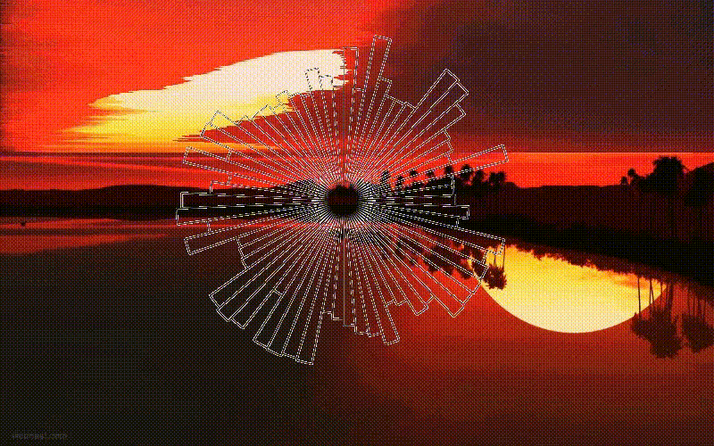

**Python Version : 3.7.3**

# Make Art With Python

The project comprises of three individual different tasks . Initially , it takes a picture into account and then a pixel-sort algorithm is applied to it after the picture is sorted , for every pixels its sound frequency is calculated and stored in an audio file . The last part of the project includes creating an audio-visualizer like effect with the help of matplotlib circular bar plot with different frequencies range . In the end , a video is made by combining all the elements with the help of ffmpeg commands . 

## Getting Started

These instructions will get you a copy of the project up and running on your local machine for development and testing purposes. The main requirement is a normal python ide installed on your computer .  

This is an easy process as I have made the entire code cmd user-friendly based . However the process will take a long time as many processes are occuring systematically . However if you want to make any customization to the code as the time duration of the audio as well as plot video all should match , you can change the speed factor . 

### Prerequisites

The libraries required for the project to work fluently are written as follows and  can be installed using a single command on your cmd . 

>>> Opencv-python ; Numpy ; math ; colorsys ; Pandas ; os ; argparse  ; tqdm                  
>>> librosa ; more_itertools ; scipy ; subprocess ; shutil ; shlex ; matplotlib 
>>> Moviepy ; PIL

```
pip install -r requirements.txt
```

### Installing

A step by step series of examples that tell you how to get a development env running

1.git clone the repository on your respective command line . 

```
git clone 'https://github.com/AemieJ/art-with-python.git'
```

2.Dive into the repository cloned on your desktop

```
cd art-with-python
```

3.Store any image you wish into the Images folder or you can try one of the image from the folder . After saving into the Images folder , your entire process will execute with this one line of command as follows . 

```
python pixel-sort.py -f sunset 
```
Here , sunset is one of the images in the folder Images . 



## Running the tests

After the entire process is completed , all your files will be stored in another folder called Image_sort and you can use them . However , if there is time duration error such as the plot on top of the video finishes before the video gets over it's due to the speed factor . 

### Guide to change the speed factor

As you have a python ide installed on your system , then from the art-with-python folder open the sound.py and the visual_plot.py . You can experiment with the speed factor to satisfy your requirements . 

In the sound.py , line 60 governs the speed factor for the audio .  
```
data_fast = librosa.effects.time_stretch(data,10.0)
```
Here , the audio is 10x times the original audio . You're free to experiment with any number . 

In the visual_plot.py , line 93 governs the speed factor of the audio visualizer created with matplotlib . 
```
sped_up_video = concat_clip.speedx(factor=5.0)
```
Here , the plot video is sped up to 5x times . You're free to experiment with any number . 

## Built With

* [Matplotlib](https://github.com/matplotlib/matplotlib) - Library for data visualization
* [Pandas](https://pandas.pydata.org/) - Library for forming data frame structures
* [Numpy](https://www.numpy.org/) - Library dealing with complex array structure
* [Moviepy](https://zulko.github.io/moviepy/) - MoviePy is a Python module for video editing
* [ffmpeg](https://ffmpeg.org/ffmpeg.html) - Software suite of libraries and programs for handling video, audio, and other multimedia files and streams.


## Authors

* **Aemie Jariwala** - *Initial work* - [AemieJ](https://github.com/AemieJ)


